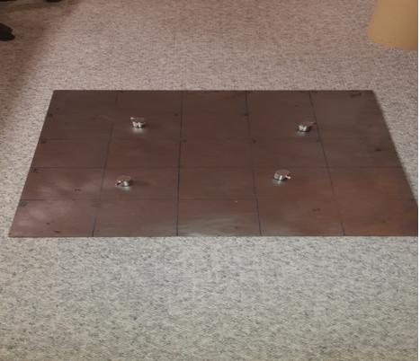
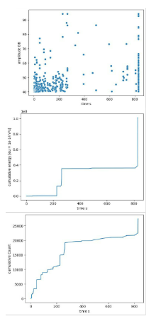
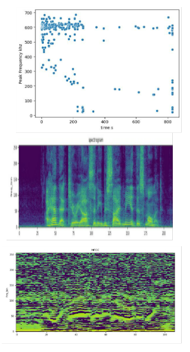
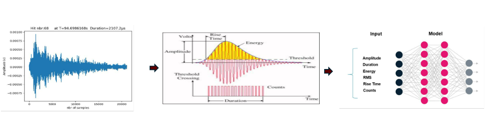
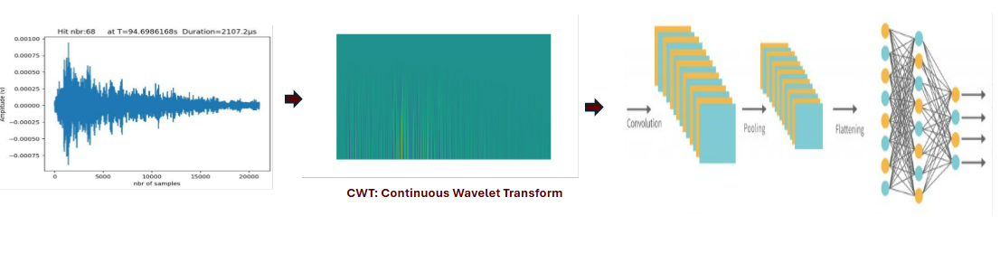
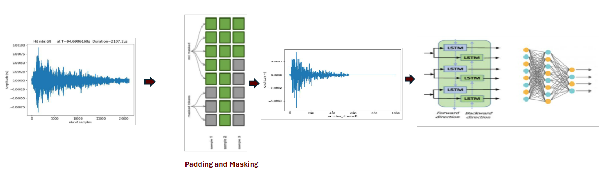

# signal-classification

## Setup:

- Steel plate (750 x 750 x 4) mm
- 4 sensors of type VS150-RIC (34 dB gain)
- Acquisition settings:
  - Digital filter: bypass -> 85-2400 kHz (analog filter)
  - Threshold: 40 dBAE
  - Sample rate: 5 MHz
  - Pretrigger samples: 2048
  - Post-duration samples: 1024

Four different sources (source mechanisms):

1. Sherbet powder (cavitation): Sherbet powder was applied to the substrate surface (in small piles) and sprinkled with water until a visible reaction took place (bubble formation).

2. Fiber friction (soft on hard): The part with the barbs was used from a commercially available hook and loop fastener and the barbs were brought into contact with the substrate. The hook and loop fastener was then moved in circles over the substrate using variable pressure applied with fingers.

3. Sand (impacts): Sand with a maximum grain size of 1 mm was dropped onto the substrate surface from a height of approx. 20 cm.

4. Sand friction (hard on hard): A small metal plate was passed over the substrate surface. Grains of sand were placed between the metal plate and the substrate.

The data set if balanced with ~6900 records for each source.

## Time-Domain Features ​

Time-domain features describe the signal's properties based on its amplitude variations over time​

Rise Time: Time taken for the signal to reach its peak from the baseline. ​

Counts: Number of significant signal events detected. ​

Counts to Peak: Number of events leading up to peak amplitude. ​

Duration: Total duration of the detected event ​

Peak Amplitude: The highest absolute value of the signal’s amplitude, identifying sudden spikes. ​

Energy: Total power of the signal, computed as the sum of squared amplitudes. ​

Crest Factor: Ratio of peak amplitude to RMS, indicating the presence of sudden peaks. ​

Zero-Crossing Rate (ZCR): Measures how often the signal crosses zero, useful for detecting oscillatory behavior. ​

RMS-Crossing Rate (RMSCR): Counts how often the signal crosses its RMS value, useful for fluctuation
analysis

## Frequency-Domain Features​

Frequency-domain features describe the signal in terms of its frequency content after performing an FFT.​

Peak Amplitude:​
The highest amplitude in the frequency spectrum.​

Peak Frequency:​
The frequency at which the highest amplitude occurs.​

Strong Peak:​
The most dominant frequency component in the spectrum.​

Spectral Centroid:​
The "center of mass" of the frequency spectrum, representing its balance.​

Spectral Flatness:​
Determines how flat or peaked a spectrum is. A high value indicates noise-like signals, while a low value suggests a tonal signal.​

Spectral Rolloff (95%, 90%, 75%, 50%):​
The frequency below which a certain percentage of total spectral energy is contained. Helps distinguish between tonal and percussive sounds.​

High-Frequency Content (Masri, Brossier, Jensen methods):​
Measures how much energy is concentrated in high-frequency ranges, useful for analyzing sharp transients.​

Partial Power (10-500 kHz, 128 bands, Linear Scale): requires multiple FFT bins to be summed​
Divides the frequency spectrum into 128 linear bands and measures power in specific ranges.​

Mel-Frequency Cepstral Coefficients (MFCC, 64 bands): FFT + Mel Filter Bank + DCT (Discrete Cosine Transform)​
Commonly used in speech and sound analysis. Extracts important frequency characteristics based on the Mel scale, which mimics human hearing.

## Classification
1. Feature-Based Machine Learning and MLPs​

Extracting relevant features from acoustic emission data enables traditional
machine learning (ML) and Multi-Layer Perceptron (MLP) models to process
and classify events efficiently. By converting raw signals into numerical
representations such as amplitude, frequency content, energy, and statistical
properties, these models can learn from structured data with reduced
computational complexity. Feature-based approaches excel in scenarios where
domain knowledge can guide feature selection, allowing for interpretable
decision-making. Additionally, probabilistic models and statistical methods,
such as Gaussian Mixture Models (GMMs) and Hidden Markov Models
(HMMs), can enhance pattern recognition by modeling uncertainties in the
data. This method is computationally efficient, enabling real-time inference
with minimal hardware requirements. However, it may struggle with capturing
complex temporal dependencies or spatial representations of signal variations

2. Image-Based Deep Learning with CNNs​

Transforming acoustic emission signals into images (such as spectrograms or
wavelet transforms) unlocks the power of Convolutional Neural Networks
(CNNs). This approach leverages the spatial hierarchies of CNNs to extract
high-level patterns from frequency-time representations, making it highly
effective for classification, anomaly detection, and forecasting tasks. By
encoding the signal into a 2D representation, CNNs can automatically learn
meaningful features without the need for manual feature engineering,
improving adaptability and generalization. However, this comes at the cost of
increased computational complexity and memory requirements, making real-
time inference more demanding. The trade-off lies in balancing model
accuracy and computational efficiency, as CNNs often require specialized
hardware (such as GPUs) for optimal performance.

3. Raw Signal Processing with RNNs and Transformers​

Maintaining the full waveform as input, combined with padding and masking
techniques, allows for sequential modeling using Recurrent Neural Networks
(RNNs), Long Short-Term Memory (LSTM) networks, and Transformers.
These architectures capture long-term dependencies in the signal, making
them particularly effective for time-series forecasting and anomaly detection.
Unlike feature-based ML, RNNs do not require handcrafted features, and
unlike CNNs, they do not need signal transformation into images. However,
the trade-off is significant computational overhead, as recurrent models must
process sequences step by step, leading to longer inference times.
Transformer-based models, such as attention mechanisms, can improve
efficiency by parallelizing computations, but they require substantial
computing power. While this method can achieve high accuracy by
preserving the full temporal resolution, its real-time deployment is more
challenging due to inference speed constraint

